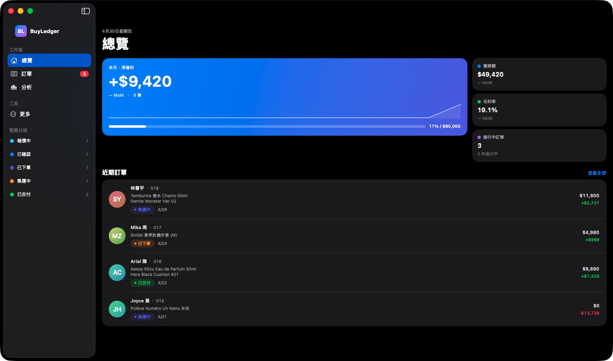
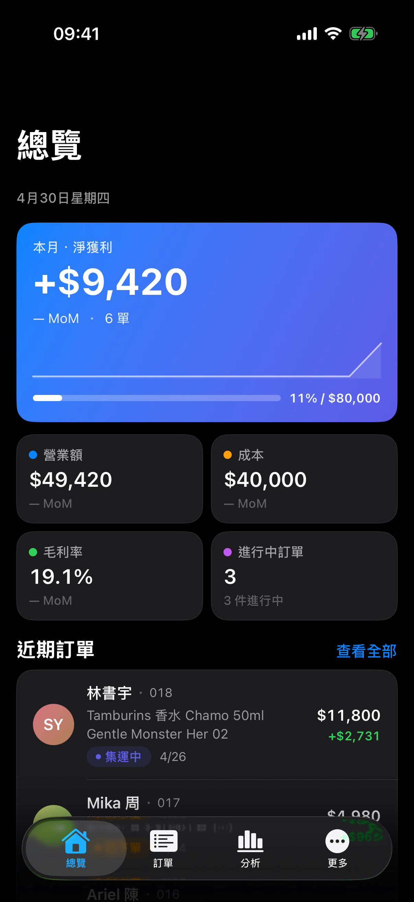
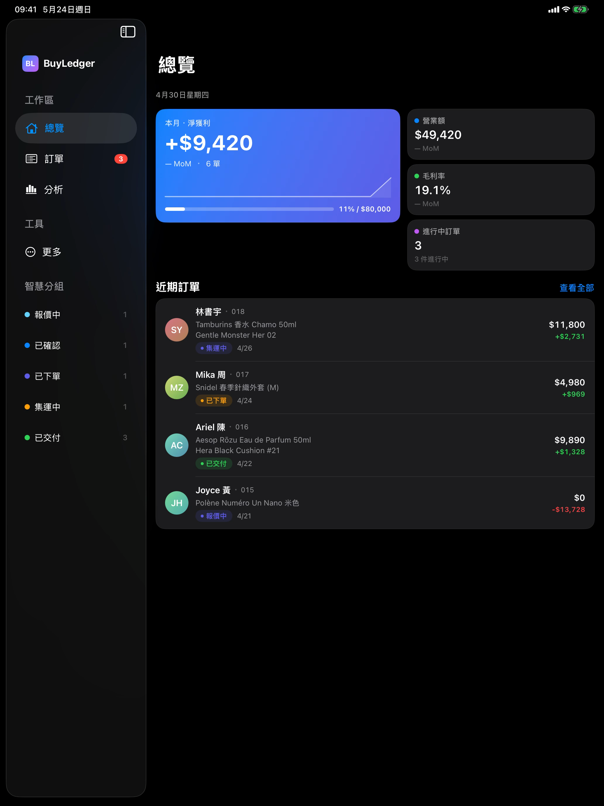

# BuyLedger

為個人代購業務而生的本地優先帳本 App。目前提供 Apple 平台版本 (iOS、iPadOS、macOS)，未來規劃擴展 Android、Web 與 Backend。

<details open>
  <summary>🖥️&nbsp; <b>macOS</b></summary>
  <br>
  <p align="center"></p>
</details>

<details>
  <summary>📱&nbsp; <b>iOS</b></summary>
  <br>
  <p align="center"></p>
</details>

<details>
  <summary>📲&nbsp; <b>iPadOS</b></summary>
  <br>
  <p align="center"></p>
</details>

## 專案結構

```text
BuyLedger (repo)/
├── apps/                                 # 可部署單元 (每個平台一個子目錄)
│   ├── apple/                            # Apple 平台 App (iOS / iPadOS / macOS)
│   │   ├── BuyLedger.xcodeproj/          # Xcode 專案；project.pbxproj 提交、xcuserdata/ 不提交
│   │   ├── BuyLedger/                    # App source root (App / Core / Features / Shared / Resources)
│   │   ├── BuyLedgerTests/               # 單元測試 + swift-snapshot-testing baseline
│   │   └── BuyLedgerUITests/             # UI 與啟動畫面測試
│   ├── android/                          # (未來，尚未建立) Android App
│   ├── web/                              # (未來，尚未建立) Web App
│   └── backend/                          # (未來，尚未建立) Backend
├── shared/                               # 跨平台共享內容
│   └── data-model/                       # 跨平台 Data Model schema 與產生器
│       ├── schema/                       # 統一 schema (YAML，一型一檔)
│       ├── generator/                    # datamodel-gen 產生器 (TypeScript + Bun)
│       └── fixtures/                     # 產生器 golden file 測試素材
├── openspec/                             # Spectra 規格與變更提案
└── assets/                               # README 圖片等共用素材
```

**佈局契約**：可部署單元一律放 `apps/` (每個平台一個子目錄)，跨平台共享內容放 `shared/`，`openspec/` 與 `assets/` 留在根目錄。未來平台 (Android、Web、Backend) 待實際動工時才建立——目前不放 stub，僅在此文件化保留位置；`shared/data-model` 已實際動工，含 schema 目錄、產生器與 fixtures。

## 平台導覽

| 平台                         | 位置            | 開發指南                                                                                           |
|------------------------------|-----------------|----------------------------------------------------------------------------------------------------|
| Apple (iOS / iPadOS / macOS) | `apps/apple/`   | [apps/apple/README.md](apps/apple/README.md)：技術棧、環境設定、build / test、架構速覽、Troubleshooting |
| Android                      | `apps/android/` | (未來，尚未建立)                                                                                    |
| Web                          | `apps/web/`     | (未來，尚未建立)                                                                                    |
| Backend                      | `apps/backend/` | (未來，尚未建立)                                                                                    |

各平台的 AI 協作硬規則見該平台目錄的 `CLAUDE.md`；跨平台通用規範見根目錄 [`CLAUDE.md`](CLAUDE.md)。

## 產品政策

- **UI 寧可顯示空狀態也不顯示假資料**——API 失敗或無資料時顯示空狀態，不繪空圖表也不退回 hardcoded 數字。
- **幣別清單動態載入、不可 hardcode**——cache 7 天。

## Spec-Driven Development

本專案採用 [Spectra](https://github.com/kaochenlong/spectra-app) (SDD)：

- 規格在 `openspec/specs/`
- 變更提案在 `openspec/changes/`
- 工作流程：`discuss?` → `propose` → `apply` ⇄ `ingest` → `archive`

詳細 workflow 與貢獻者注意事項見 `CLAUDE.md`。
